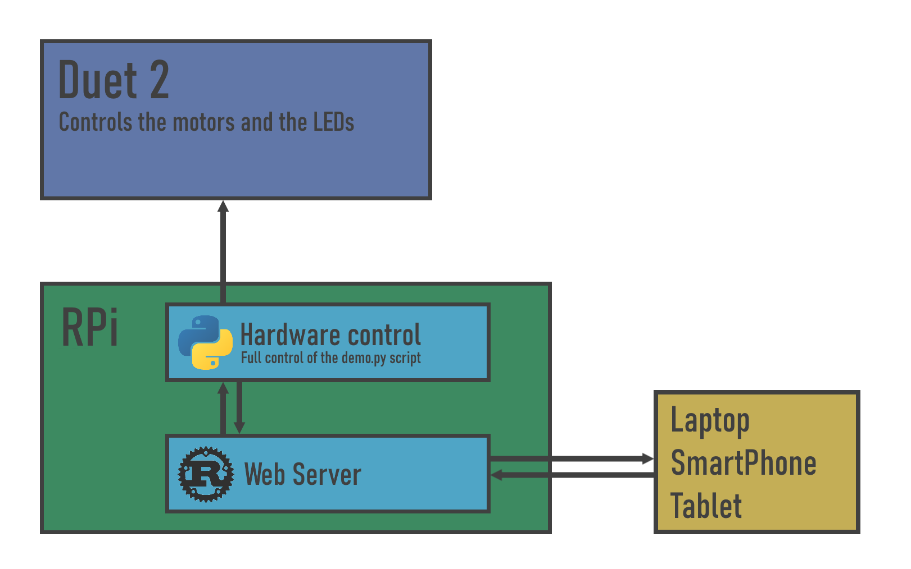

# Raspberry Pi Hardware Control in Rust and Python

Tested on Raspberry Pi 3 running on Raspberry Pi OS (32 bit).

## How to wire

Important notes:

- Make sure you have the correct amperage for the 5V power supply for your number of LEDs.
- The ground of the LEDs must be connected to a ground pin on the microcontroller.
- Add a high capacitor between the LEDs power supply and the LEDs.
- Add about a 400 ohms resistor for the data line from the microcontroller to the LEDs.

## How to use

- Connect to the bluetooth dongle by using `sudo bluetoothctl` from the Raspberry Pi. Once you have established a connection, open an RFCOMM port with `sudo rfcomm connect hci0 hc05_addr`.
- Start the Rust web server with `ROCKET_ENV=staging cargo run --release` in the `WebServer/` folder.
- Start the Python controller with `python3 demo_controller_app.py` in the `ScriptControl/` folder.
- Open a browser and enter the `RPi_IP:8000` as the URL.
