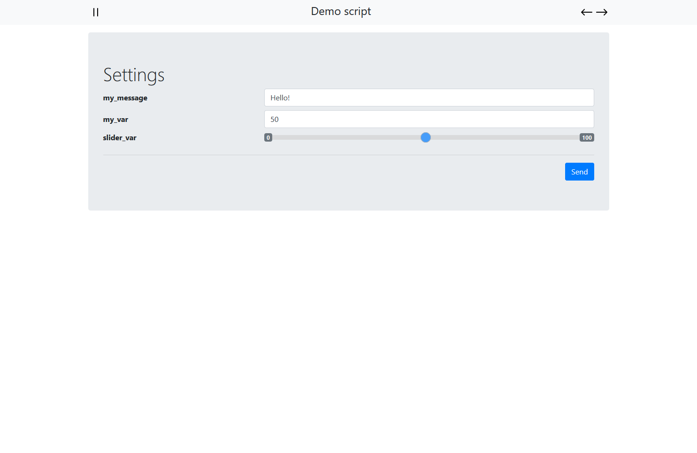

# Rocket RPi Web-App Controller

To build and run:

`ROCKET_ENV=staging cargo run` (`ROCKET_ENV=staging` enables the server to be accessible from the local network and not just the localhost).
Optionally, you can use the command `ROCKET_ENV=staging cargo run --release` for faster builds on the Raspberry Pi.

## How to use

You can use the app through the interface. To connect open a browser and type in `ip_raspberrypi:8000` as the URL.
